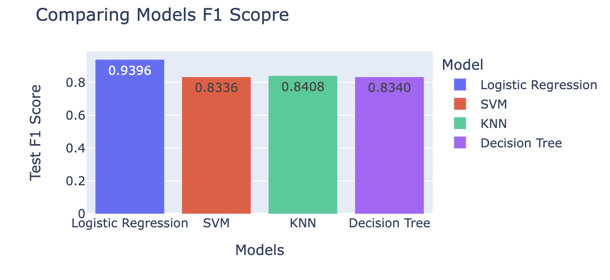
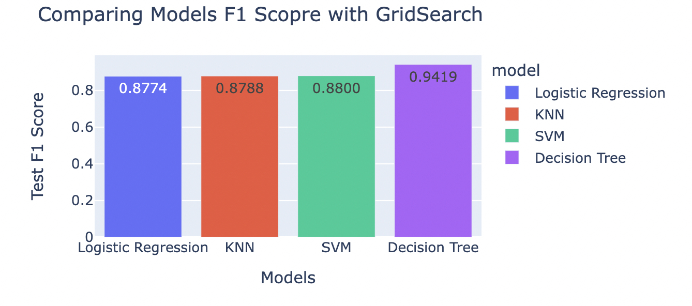

## Practical Application III: Comparing Classifiers

### Overview: 

In this practical application, your goal is to compare the performance of the classifiers we encountered in this section, namely K Nearest Neighbor, Logistic Regression, Decision Trees, and Support Vector Machines. We will utilize a dataset related to marketing bank products over the telephone.

#### [Link to Note Book ](https://github.com/vytla/practical3/blob/main/practical_application_III.ipynb) 

### Business Context
The objective of this task is to determine which features are most indicative of a successful subscription to the deposit service. Through the use of classification models, our aim is to enhance campaign efficiency by pinpointing the primary factors influencing success. This approach aids in optimizing resource allocation and selecting a cost-effective yet high-quality pool of potential subscribers.

### Data Analysis 
Upon reviewing the business context, our initial focus is on familiarizing ourselves with the dataset. We undertake several steps to achieve this, aiming to understand the dataset's composition and to identify any potential quality issues. Our exploration entails examining the available information and assessing its relevance to our business objectives. Following our data exploration, we observe the following:

- The dataset exhibits no instances of missing values.

- We analyze the subscription acceptance rates across categorical features to gain insights into customer preferences.

- Several categorical columns contain 'unknown' values, which could impact our modeling efforts.

- We utilize a correlation matrix to identify numerical features that demonstrate stronger correlations with the target variable (subscription acceptance: yes/no).

### Feature Engineering

I utilized the OneHotEncoder to encode categorical columns and applied the StandardScaler to scale numerical features on given dataset.

### Modeling 

- Divided the data into training and testing sets, with a test set size of 25%.

- Given the imbalanced nature of the data (89% 'no' and 11% 'yes'), establishing a baseline model was crucial. To achieve this, we employed a DummyClassifier, which yielded a prediction accuracy of approximately 88.9%, closely aligning with the natural data split.

- Developed a basic Logistic Regression model using a subset of our data, primarily composed of categorical features, to gauge its performance in a real-world classification scenario. The outcomes resembled those obtained from the dummy classifier.

- Compared the performance of Logistic Regression model against algorithms such as KNN, Decision Tree, and SVM with default settings. 

- Our main objective was to enhance the models' performance through the utilization of GridSearchCV, focusing on fine-tuning the hyperparameters of each model.

### Observations 

- With subset of data, Logistic Regression outperforms other models, given its superior testing F1 score and accuracy, especially in light of the dataset's imbalance

- Considering the additional features, the SVM model achieves the highest accuracy score (0.9030), while the Decision Tree exhibits the highest test F1 score (0.9419). Given the dataset's imbalance, prioritizing the F1 score, the Decision Tree emerges as the optimal model

#### GridSearchCV best parameters 
- Logistic Regression: {'model': LogisticRegression(max_iter=500), 'params': {'max_iter': 500, 'solver': 'lbfgs'}
- KNN : {'model': KNeighborsClassifier(n_neighbors=50), 'params': {'algorithm': 'auto', 'n_neighbors': 50}
- SVM : {'model': SVC(kernel='linear'), 'params': {'gamma': 'scale', 'kernel': 'linear'}
- Decision Tree : {'model': DecisionTreeClassifier(max_depth=2, min_impurity_decrease=0.01,
                       min_samples_split=0.1), 'params': {'max_depth': 2, 'min_impurity_decrease': 0.01, 'min_samples_split': 0.1}}

### Recommendations       
Based on the observations, we propose the following recommendations:

Target customers who:
- Are single
- Have job statuses as students, entrepreneurs, or retirees
- Maintain a non-default credit status

